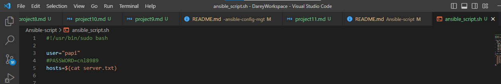
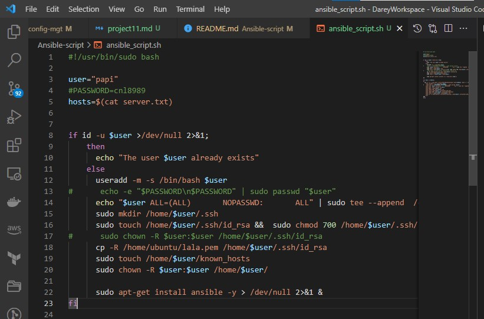

# Script to automate ansible installation and configuration.
### The ansible configuration will consist of the following steps:
```
- Create a common user in the master and across all the slaves

- Enable sudo permission for the admin user with no password

- Enable ssh key authentication between master and all the slaves

- Install Ansible.

```

# Prerequisite

### Before running the script, complete these prerequisites.
```
1- create a server.txt file and add the private IP address of all your slave servers.

2- Get a key pair (you can create one using the ssh-keygen command), proceed to create a .pem file in your current directory and copy your private key into the file.

3- This step is optional but you can also create a second file to contain your public key

```

# Breaking Down the Script into segments for Beginners

## Segment-1
 

- #!/usr/bin/sudi bash: To give root privileges to a user while executing a shell script

- Declare variables "user" and "hosts". User will be your ansible admin user while hosts is a txt file containing the ip address of your ansible slave servers.

## Segment-2


### This segment is executed on the ansible master.

### This line uses the if conditional to check the user already exists, if it does the code prompts "the user already exists" and the script id not executed, if the user doesn't exist, the next line of code is executed
- `if id -u $user >/dev/null 2>&1;`

### This command creates the user with a default home directoty (-m flag) and sets it's shell to bash

- `useradd -m -s /bin/bash $user`

### This command edits the sudoers file and adds the user. This enables the user perform sudo commands without it requesting for password

- `echo "$user ALL=(ALL)       NOPASSWD:       ALL" | sudo tee --append  /etc/sudoers`

### A good understanding of ssh key authentication is required. In a nutshell, ansible master connecting via ssh will have a private key contained in the .ssh/id_rsa path in the home directory of the ansible admin user. The corresponding public key of this private key will be situated in the .ssh/authorized_keys path in the home directory of the ansible admin user in the slave servers.

### This commands creates a .ssh folder in the home directory of user 

- `sudo mkdir /home/$user/.ssh`

### These commands creates the id_rsa file and sets the necessary permissions

- `sudo touch /home/$user/.ssh/id_rsa &&  sudo chmod 700 /home/$user/.ssh/id_rsa`

### This command copies the private key of the key pair to be used for ssh auth into the id_rsa file of the user created above. Note that the path of your key will defer

- `cp -R /home/ubuntu/lala.pem /home/$user/.ssh/id_rsa`

### This command creates a known_hosts file in the .ssh folder. The Ip of the slaves are stored in this file at the first attempt of connection to enable the ansible master ssh easily into the slaves subsequently.

- `sudo touch /home/$user/known_hosts`

### This command sets ownership permissions

- `sudo chown -R $user:$user /home/$user/`

### This command installs ansible, directs the outputs of the command to dev/null and runs the install ansible command in the background.

- `sudo apt-get install ansible -y > /dev/null 2>&1 &`

## Segment 3
### This segment is executed on the ansible slaves

### You ssh into the a slave server using the private key you created earlier. The ssh -t -t forces pseudo tty allocation. The "StrictHostKeyChecking=no" disables the host key check and automatically add the host key to the list of known hosts. EOF specifies a block of commands to be executed on the server and enables expansion of variables from your machine to the machine you ssh'ed into.

- `ssh -t -t -i lala.pem -o StrictHostKeyChecking=no ubuntu@$host 'bash -s' << EOF`

### After a successful ssh, this commands adds creates the admin user and adds the user to sudoers group

- `sudo useradd -m -s /bin/bash $user`

- `sudo echo "$user ALL=(ALL)       NOPASSWD:       ALL" | sudo tee --append  /etc/sudoers`

### These commands creates a .ssh folder in the home directory of the user and sets permissions for the directory

- `sudo mkdir /home/$user/.ssh && sudo chmod 700 /home/$user/.ssh`

### These commands create the authorized_keys file and set permissions for it

- `sudo touch /home/$user/.ssh/authorized_keys && sudo chmod 600 /home/$user/.ssh/authorized_keys`

### Set ownership permission

- `sudo chown -R $user:$user /home/$user/.ssh`

### Copy the public key into the authorized_keys file. Note that the path to your public key might be different depending on where it id located

- `sudo cp -R /home/ubuntu/.ssh/authorized_keys /home/$user/.ssh/authorized_keys`

### Then exit and close.

